# CSE 15L Week 2 Lab Report 1

## Step 1: Installing VScode
1. Visit the [VScode Website](https://code.visualstudio.com/)
2. Click on download (choose the right operating system for your computer to download)
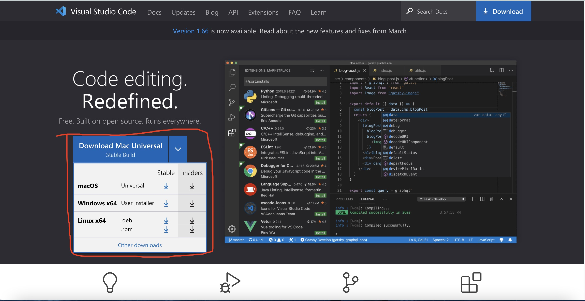
3. Follow instruction to install Vscode
4. When install successfully, you should be able to open VScode with a window that looks like this: 
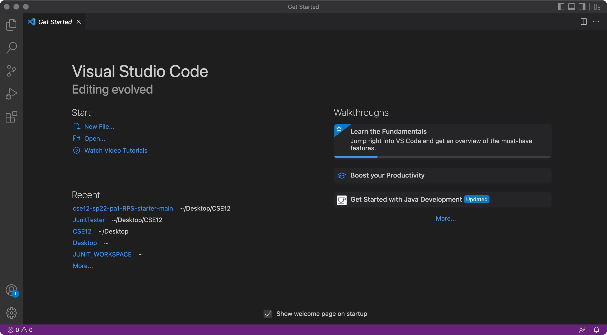


## Step 2: Remote Connecting
1. Install OpenSSH software [here](https://docs.microsoft.com/en-us/windows-server/administration/openssh/openssh_install_firstuse) (skip this step if SSH already installed)
2. Look up your course specific account for CSE 15L (used for log in) [here](https://sdacs.ucsd.edu/~icc/index.php
)
3. Open VScode and open a terminal inside VScode
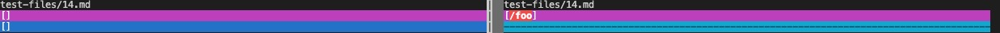
4. Type the following command into the terminal:

    `ssh cs15lsp22zz@ieng6.ucsd.edu`

    Note: Replace the zz with your course-specific account
5. If you are connecting to the server for the first time, you should see some messages like: 
    ```
    The authenticity of host 'ieng6.ucsd.edu (128.54.70.227)' can't be established.

    RSA key fingerprint is SHA256:ksruYwhnYH+sySHnHAtLUHngrPEyZTDl/1x99wUQcec.

    Are you sure you want to continue connecting (yes/no/[fingerprint])?
    ```
    Simply press yes
6. Enter your password (note that the password is not shown)
7. If you enter your password correctly, you should be able to connect to the server, as shown below: 
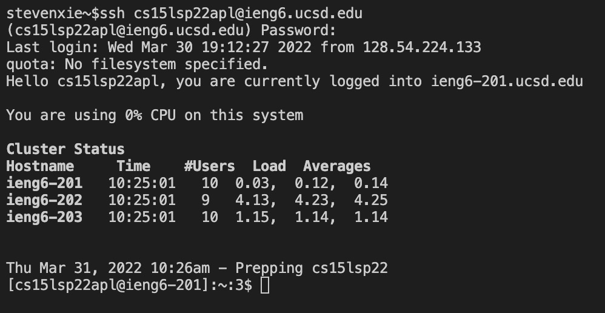

## Step 3: Trying Some Commands
1. Try running the following commands, and notice the output:
* cd - Changes the current directory
* ls - Used to list the files in a directory
* pwd - Shows the current directory you are in
* mkdir - Used to create a direcotry
* cp - Copies a certain file
* cd .. - change current directory to previous directory

    Some examples are shown below:
    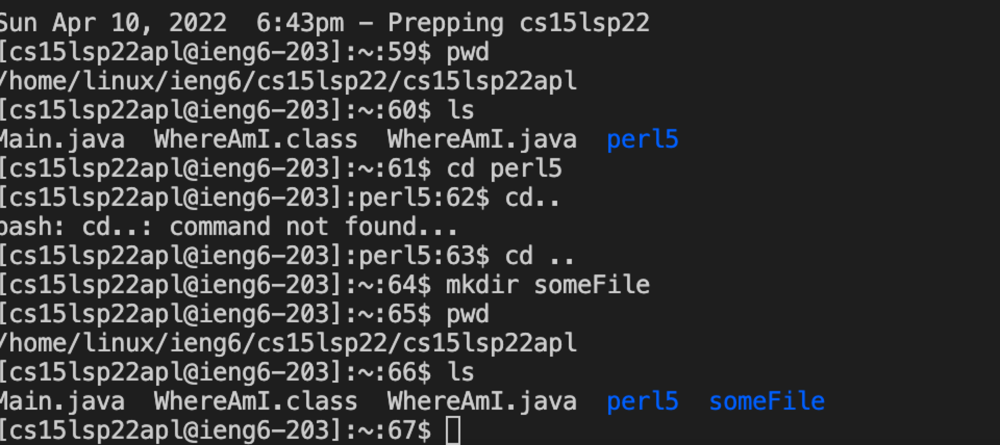

## Step 4: Moving Files with SCP
1. Create any java extension file using VScode
2. Type the following command into the terminal:

    `scp <name of file>.java cs15lsp22zz@ieng6.ucsd.edu:~/`
    
    Note: Replace zz with your course specific account

3. Enter your password
4. Log into the server using the ssh command again, then type the `ls` command and you should see your file has been copied to the server:
5. You can run the file using the `javac` and `java` commands, since java is installed on the server, as shown below: 
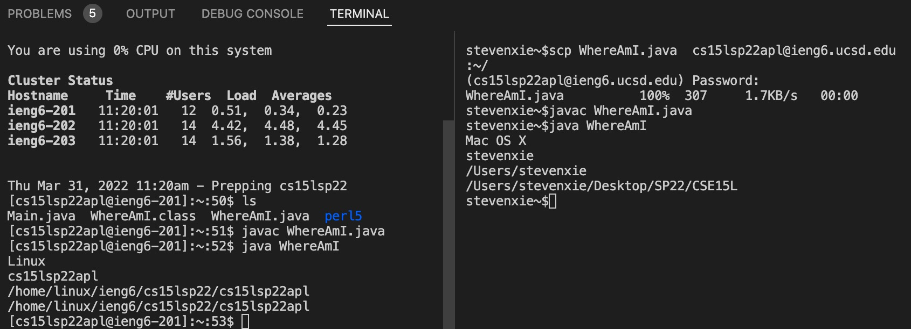

## Step 5: Setting an SSH key
1. Enter `ssh-keygen` into the terminal
2. Enter the file that you would like to save the key at
3. Do not enter a passphrase
4. The whole process should look like the picture shown below: 
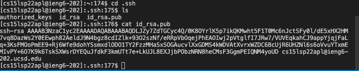
5. Next, log into the server by entering the ssh command and your password
6. enter the command `mkdir.ssh`
7. log out the server by entering `exit`
8. Enter the following command into the terminal:
    ```
    scp /Users/<user-name>/.ssh/id_rsa.pub cs15lsp22zz@ieng6.ucsd.edu:~/.ssh/authorized_keys
    ```
9. Enter your password
10. The whole process should look like the picture shown below: 

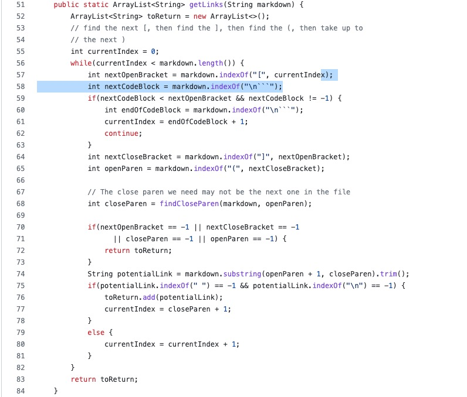

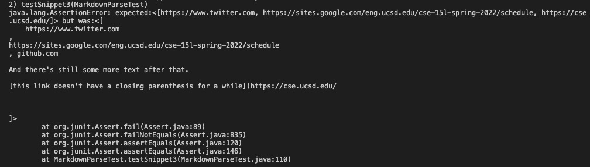

If everything runs correctly , now you should be able to log into the server without entering a password

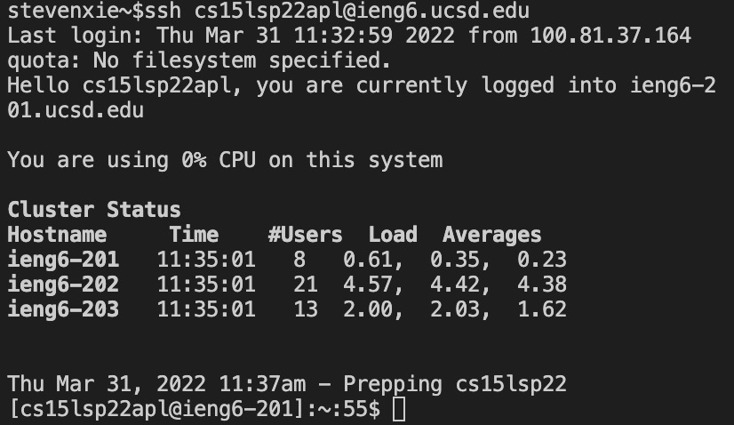

## Step 6: Optimizing Remote Running
To make the process much faster for you, you can do
the following commands

* You can write a command in quotation marks after the ssh command to run the command on the server and then exit immediately

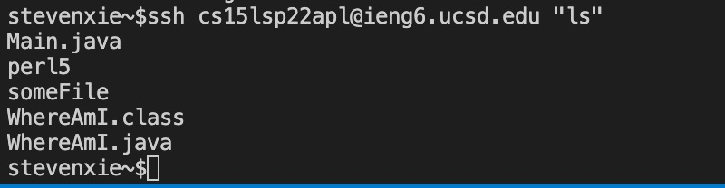

* You can use the up-arrow on the keyboard to use the command that you previously entered before

* You can run multiple commands on the same line by putting a semi-colon between them

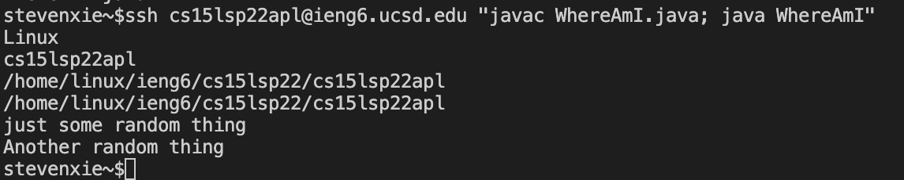


    

