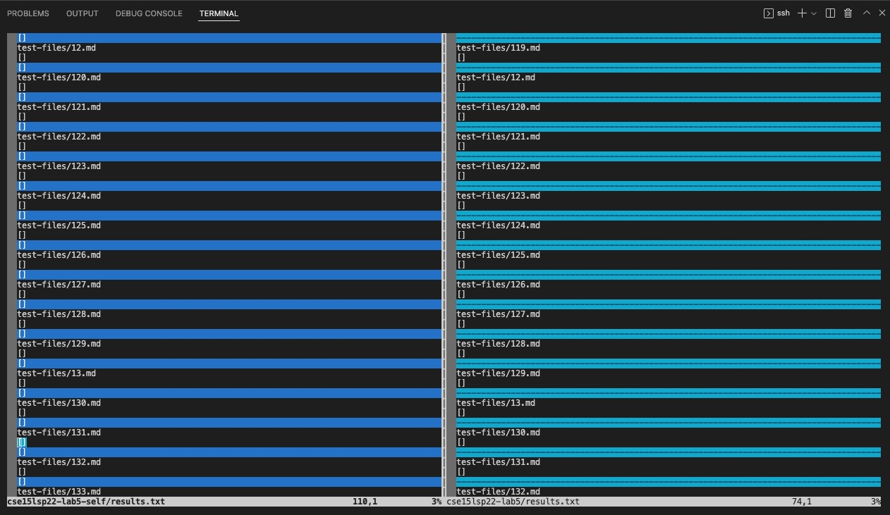

# CSE 15L Week 6 Lab Report 3

Link to my markdown-parse repository: [link](https://github.com/stevex626/markdown-parser)

Link to markdown-parse repository reviewed in week 7: [link](https://github.com/mv5903/markdown-parser)

## Expected Outputs Using VScode Preview
* Snippet 1: 

Expected output should be: [`google.com, google.com, ucsd.edu]

* Snippet 2: 

Expected output should be: [a.com, a.com(()), example.com]

* Snippet 3: 
Expected output should be: [https://sites.google.com/eng.ucsd.edu/cse-15l-spring-2022/schedule]

