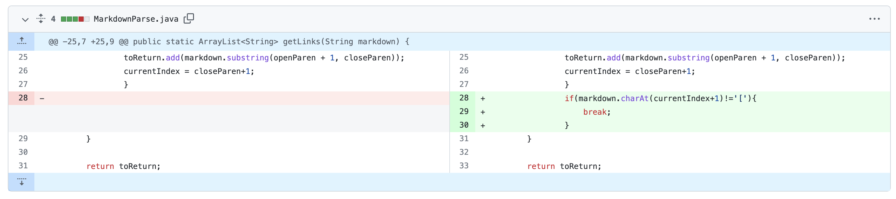
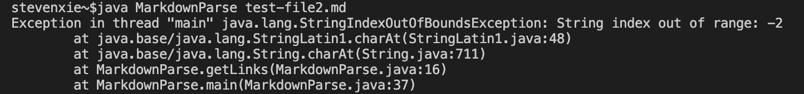
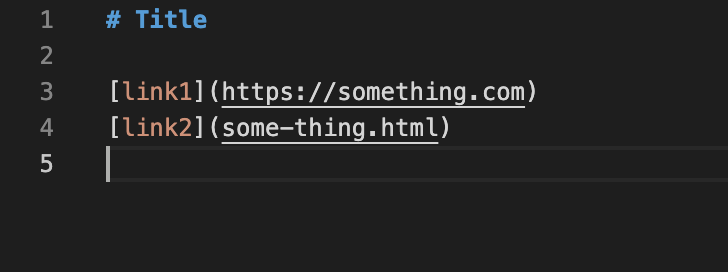

# CSE 15L Week 4 Lab Report 2

## Code Change #1
### The first test case contains some images in it

* Screenshot of the code change

* [Link](https://github.com/stevex626/markdown-parser/blob/main/test-file3.md) to the failure-inducing input
* Screen shot of the symptom

* The *failure-inducing input* in this test case is an image input. As shown above, we should expect the output to be `[some-thing.html]`, however the actual output we get has a *symptom*, which means that it has a wrong output of `[https://something.com, some-thing.html, https://something.com]`. The bug is at line **14** as we didn't add any condition to check whether the input is an image or not; to fix the bug, we add ` if(markdown.charAt(openBracket-1)=='!')` after line 14 to check the condition of the input.

## Code Change #2
### The third test case contains a random text line at the end (after a blank line)

* Screenshot of the code change

* [Link](https://github.com/stevex626/markdown-parser/blob/main/infiniteLoop.md) to the failure-inducing input
* Screen shot of the symptom

* The *failure-inducing input* in this test case is adding a blank line at the end of the file. The *symptom* is that the program did not have the correct output and instead it produces a `StringIndexOutOfBoundsException`. The bug is at line 16, where we forget to make the while-loop ends before the blank line. 

## Code Change #3
### The second test case contains a blank line at the end

* Screenshot of the code change

* [Link](https://github.com/stevex626/markdown-parser/blob/main/test-file2.md) to the failure-inducing input
* Screen shot of the symptom

* The *failure-inducing input* in this test case is adding a random line of text at the end of the file. The *symptom* is that the program did not have the correct output and instead it also produces a `StringIndexOutOfBoundsException`. The bug is also at line 16, where we need to add one more condition to check whether there is something after the blank line (check if it is a link or something else); if it is a link, keep executing the loop, terminate otherwise.
