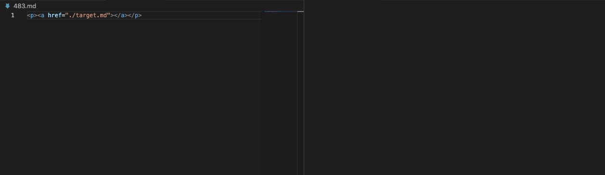
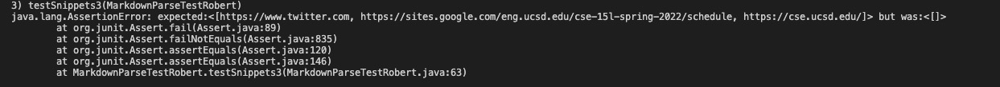

# CSE 15L Week 6 Lab Report 3

## Streamlining ssh Configuration
* Open the ssh folder on your local device. I am using a MacBook so
I can find and open the .ssh file through using the "Spotlight Search",
as shown below


* Open a folder named "config" inside the ssh folder. If the folder doesn't exist, create one inside the ssh folder with a "txt" extension.


* Type the following into the config folder
```
Host ieng6
    HostName ieng6.ucsd.edu
    User cs15lsp22apl (this is my username)
```

* Now try and type `ssh ieng6` in your terminal. If everything is set up correctly, you should see something similar to the picture below
 

* If we want to use the `scp` command to copy a file from the local to the remote server, we can just simply type the following line:
`scp helloworldtext.txt cs15lsp22apl@ieng6.ucsd.edu:~/` 
where the file name and its extension follows the `scp` and then the course-specific account username at the end.

* Now we log in back to **ieng6** and we see that the text file has been copied to the remote server


## Setup Github Access from ieng6
* For this setup, we need to enter the following command to generate an SSH key on the remote server
`ssh-keygen -t rsa`
Screenshot is shown below

 

* Then, we should use the `cat` command to show and then copy the contents in the public key and then paste it onto the *SSH Key* setting on GitHub



* Screenshot of the private key on my user account


* Screenshot of the public key on my user account


* Copy and paste the contents and create a new SSH key on GitHub


* Now we go back to the server and we clone our repository into the **ieng6** server using the SSH key clone, which is shown below


* After we cloned the repository, we should `cd` into the repository and then make some changes to the MarkdownParse file
Here I deleted two comments and added two new comments:



I have also used the `touch` command to add a new blank file named "hello.txt" inside the markdown-parser repository


* Now, we should add all the files into the repository using `git add .` and make commits using `git commit -m "Update messages"`


* Lastly, use the `git push origin main` command to push your changes to GitHub, as shown below


* [Link](https://github.com/stevex626/markdown-parser/commit/7a2f331c4338c109b7ab38e6dd48ccf40952f67c) for the resulting commit

## Copy Whole Directories with `scp -r`
* First, we copy the whole **markdown-parse** directory to **ieng6** by entering the following command
`scp -r . cs15lsp22apl@ieng6.ucsd.edu:~/markdown-parse` (change apl to your own course-specific username)


* Now when you log into the **ieng6** remoter server, you should be able to see the **markdown-parse** directory


* Then, we use the following commands to run the Junit Test on the remote server

```
cd markdown-parse; javac -cp .:lib/junit-4.13.2.jar:lib/hamcrest-core-1.3.jar MarkdownParseTest.java; java -cp .:lib/junit-4.13.2.jar:lib/hamcrest-core-1.3.jar org.junit.runner.JUnitCore MarkdownParseTest
```

 

* The last step is that we need to do all these steps all in one line. To accomplish this, we can enter the following commands in our terminal

```
scp -r . cs15lsp22apl@ieng6.ucsd.edu:~/markdown-parse; ssh ieng6 "cd markdown-parse; /software/CSE/oracle-java-17/jdk-17.0.1/bin/javac -cp .:lib/junit-4.13.2.jar:lib/hamcrest-core-1.3.jar MarkdownParseTest.java; /software/CSE/oracle-java-17/jdk-17.0.1/bin/java -cp .:lib/junit-4.13.2.jar:lib/hamcrest-core-1.3.jar org.junit.runner.JUnitCore MarkdownParseTest"
```


