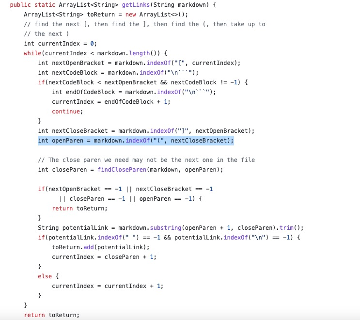
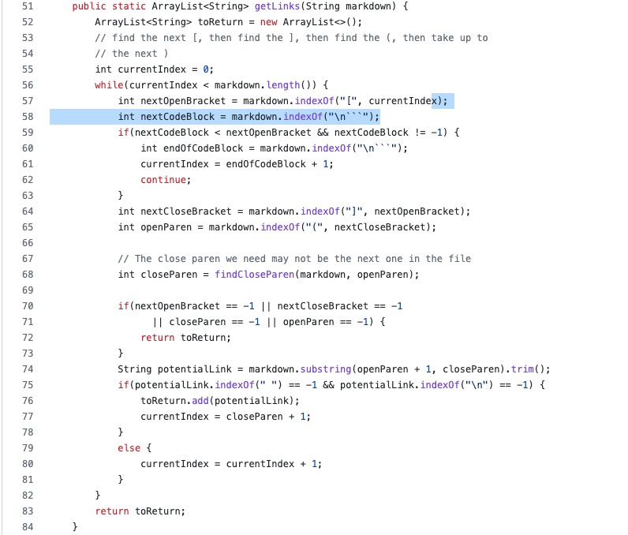

# CSE 15L Week 6 Lab Report 3

Link to my markdown-parse repository: [link](https://github.com/stevex626/markdown-parser)

Link to markdown-parse repository reviewed in week 7: [link](https://github.com/mv5903/markdown-parser)

## Expected Outputs Using VScode Preview
* Snippet 1: 

Expected output should be: [`google.com, google.com, ucsd.edu]

* Snippet 2: 

Expected output should be: [a.com, a.com(()), example.com]

* Snippet 3: 
Expected output should be: [https://www.twitter.com, https://sites.google.com/eng.ucsd.edu/cse-15l-spring-2022/schedule, https://cse.ucsd.edu/]

## Turn into a test 
* Snippet 1: 

* Snippet 2: 

* Snippet 3: 

## Test on my implementation
* Snippet 1: 

As you can see, my test has failed for Snippet 1

* Snippet 2: 

As you can see, my test has failed for Snippet 2

* Snippet 3: 

As you can see, my test has failed for Snippet 3

## Test on my peer's implementaion
* Snippet 1: 

As you can see, my peer's test has failed for Snippet 1

* Snippet 2: 

As you can see, my peer's test has failed for Snippet 2

* Snippet 3: 

As you can see, my peer's test has failed for Snippet 3

## Comments On Code Changes
* Snippet 1: Yes, I can definitely fix this in under 10 lines of code. I just need to add a condition to check whether the line starts with a "\`" character, if so, skip the whole line. But I also need to add a condition to check this only if the file contains the "`" character.

* Snippet 2: Yes, I think it is possible to fix my code in under 10 lines. I need to add some conditions to check for escape characters as well as checking for multiple parenthesis inside the line. 

* Snippet 3: No, I don't think it is possible to do change to my code and pass the test in under 10 lines. The reason is because it requires me to have a counter to check the number of brackets and parenthesis in the line in order to determine whether the line is a valid input line. I also need to check some conditions to get rid of the spaces and new line characters from the string. Therefore I don't think it is possible to do all these tasks in just under 10 lines.

## Code Changes
* Snippet 1: The code changes that I have made is shown below:

As explained above, I add a condition to check if the line starts with "\`" character and if so skip the whole line (it didn't matter if the character is between the other characters).
And also only do this if the file has the "\`" character.

* Snippet 2: The code changes that I have made is shown below:

Additional updates:

As explained above, I have add some conditions to check whether the one character before the brackets is an escape character. If it is indeed an escape character, we add one to the index of the brackets. Also, I have add some conditions to check multiple parenthesis in the line using similar logic in the way that I use to identify escape characters. 

