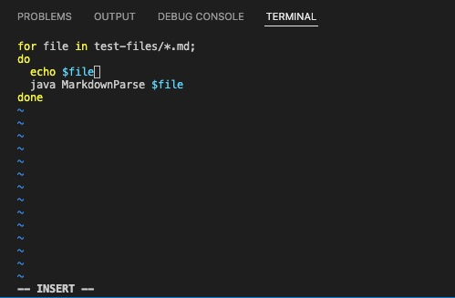

# CSE 15L Week 10 Lab Report 5

## Use vimdiff to compare results

* First, we want the most updated versions of the markdown-parser, so we want to do `git clone https://github.com/nidhidhamnani/markdown-parser.git cse15lsp22-lab5` and `git clone https://github.com/Miyuki-L/markdown-parser.git cse15lap22-lab5-self` on the server. I am using a representative implementation from my group (Helen Lin).

* Then, we type `cd cse15lsp22-lab5` to get into the directory with the "script.sh" file and then type `vim script.sh` to edit the file using vim.

* Add a line `echo $file` in the script.sh file (as shown below) and then press `:wq` to write and quit. The purpose of this step is to 

